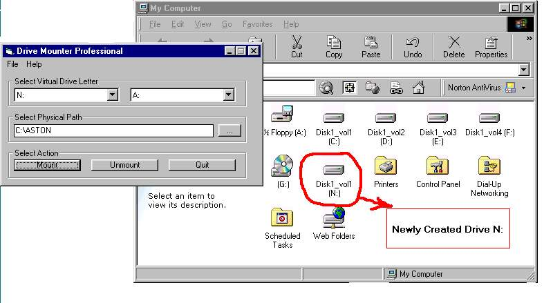



## Mount drive

### Description

you can mount virtual drives on your pc by specifying a particular physical folder path.

A drive will be created with contents of that folder with the drive letter you give.visit my site http://www.sonysms.sphosting.com
 
### More Info
 

             |
---                |---
**Submitted On**   |2003-03-18 23:25:28
**By**             |[sony\.m\.s](https://github.com/Planet-Source-Code/PSCIndex/blob/master/ByAuthor/sony-m-s.md)
**Level**          |Advanced
**User Rating**    |4.3 (30 globes from 7 users)
**Compatibility**  |VB 6\.0
**Category**       |[Windows API Call/ Explanation](https://github.com/Planet-Source-Code/PSCIndex/blob/master/ByCategory/windows-api-call-explanation__1-39.md)
**World**          |[Visual Basic](https://github.com/Planet-Source-Code/PSCIndex/blob/master/ByWorld/visual-basic.md)
**Archive File**   |[Mount\_driv1561363182003\.zip](https://github.com/Planet-Source-Code/sony-m-s-mount-drive__1-44088/archive/master.zip)

